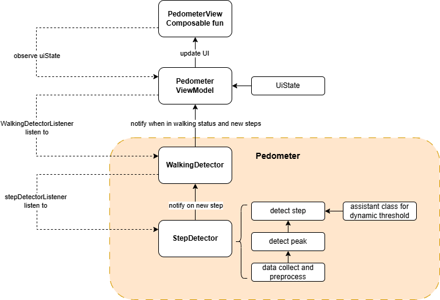
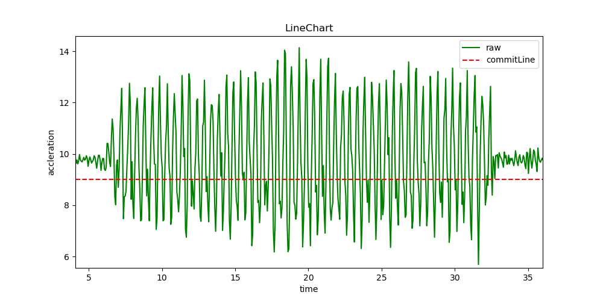

# 安卓计步器
这是一个计步器的安卓应用demo，使用手机的加速度传感器数据进行计算，使用Kotlin语言开发

# 文件结构
`DataCollectionDemo:` 前期进行数据采集和可视化时实现的简易demo  
`Pedometer:` 计步器demo

# Pedometer结构

**提示：**`config.kt` 文件包含了超参数的定义，可根据自身情况调整

* **`StepDetector:`** 检测是否产生一步
    * **`detectAndHandlePeak:`** 检测该数据点是否是峰值。检测原理如图所示，由于走路时具有周期性，因此(在一个或半个周期时，视手机位置而定)会有一上一下的两个峰，为此我们可以设置一条标准线，当加速度计值低于该标准线的时候便可认为是一个形成了一个峰值。正常来说标准线可以设置为静止时的加速度值，但是由于噪声或抖动，计步器会非常敏感，因此降低该标准线。`config.kt` 中 `COMMIT_LINE` 可以调整该标准线，值越低，计步器越不敏感，可能导致走路动作较轻时无法有效检测

    

    * **`detectAndHandleStep:`** 检测该峰值是否是合适的一步，包含峰值大小是否高于阈值，以及与前面一步的时间差是否在合理的时间范围内
* **`WalkingDetector:`** 检测行走状态。在行走状态时才认定步数，防止误判

# 参考资料
* **[phyphox](https://phyphox.org/)** 可进行数据采集和可视化
* **[DylanStepCount](https://github.com/linglongxin24/DylanStepCount)** 作为计步器算法参考